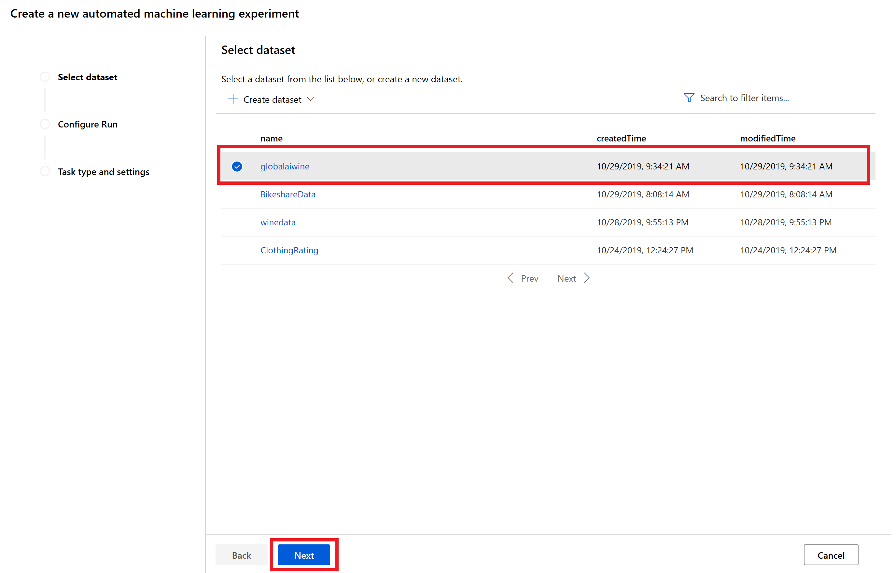

# Workshop Automated ML - Predict Wine Quality

In this case, you want to predict the quality of wine. We used a dataset from UCI Machine Learning repository that contained 6497 observations with physicochemical properties of red and white Portuguese wine and their quality (Cortez).

## Steps

### Get the data

You can obtain the data 'winedata.csv' from the GitHub repo [Wine Quality](https://github.com/mdragt/WineQuality)

Open an Edge browser and go to the new [Azure Machine Learning environment](https://ml.azure.com). *Note: this environment is in preview, so glitches can appear.*

Go to Datasets and select Create dataset, from local file.

#### Basic Info

Select the winedata.csv file.

Click on Next.

#### Settings and Preview

Now you have the option to change the settings, but in this case this is not neccesary.

Click on Next.

#### Schema

The next step is to look at the schema of the data. Here we can change the data types, and deselect columns we don't want in our dataset. In this case, we deselect "quality", which is a numeric value of the wine quality. In this case, we want to predict whether the wine is good or bad, for which we will use the dependent variable "qual_bool".

Click on Next.

#### Confirm Details

Finally, you have the option to profile your data, which gives you a generic overview of your data. Therefore, you would need a compute with at least 1 node.
To create the dataset, click on Create.

### Create Experiment

You are now ready to create a new experiment. Go to Automated ML in the left menu, and select New automated ML run.

#### Select dataset

Select the prior created dataset and click on Next.

Fill out the details to create the experiment:

* Experiment name: any name you want
* Target column: the dependent variable of your dataset, in our case "qual_bool"
* Select training compute target: the compute you want to use for this experiment

Click on Next.

#### Configure Run

In this step you can configure the ML run. By default, Classification was selected as task, which is ok. Now click on View additional configuration settings. Here you can select things like:

* Primary metric: define on which metric you want to train the model
* Training job time (in hours): the amount of hours to train the model
* Metric score threshold: minimim metric value that should be reached. I.e. you could be happy with 90% accuracy.
* etc.

Click on OK, and furthermore on Create.

The ML run will now be prepared.

During the run, you get an overview of how well the models are performing:

The running process can take quite a while (remember, we defined 1 hour as possible running time), so take a coffee and go to the next workshop.

When the running process is finished, you have the option to deploy the best model.
